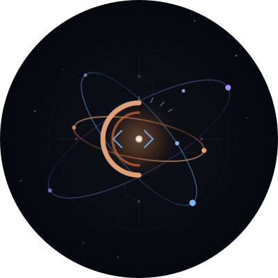

<p align="center">
  
</p>

<h1 align="center">Ouroboros</h1>

<p align="center">
  Research governance meta-project — the serpent eats its own tail.
</p>

---

**v6.28.3 (τ)** — 2026-03-09

## What It Does

Ouroboros is the coordination layer for autonomous research across multiple projects, machines, and AI agents. It provides:

- **Telegram bot** — remote control panel for training runs, GPU/disk monitoring, log tailing, and crash alerts (`bot/`)
- **Multi-agent orchestration** — file-based task queue for parallel Claude Code terminals (`team/`)
- **Research protocol** — project registry, workflow conventions, cross-project syncing (`OUROBOROS.md`)

## Active Projects

| Codename | Description | Status |
|---|---|---|
| **s_cot** | Spectral-R1: latent energy-based GRPO reasoning (NeurIPS 2025) | Training + paper |
| **long-vqa** | MMReD: cross-modal dense context reasoning benchmark | Eval ongoing |
| **bbbo** | Bayesian black-box optimization framework | Active dev |

## Infrastructure

- **Compute**: kurkin-1 / kurkin-4 (shared NFS, FSDP2, vLLM)
- **Tracking**: ClearML, Notion, Telegram alerts
- **Token efficiency**: RTK (Rust Token Killer) — 60–90% savings on CLI ops

## Setup

```bash
cp .env.example .env   # fill in TELEGRAM_TOKEN, AUTHORIZED_USERS
pip install python-telegram-bot python-dotenv
./run_bot.sh
```

## Coordination

All updates to shared files are **atomic** — each change is a single, self-contained commit that doesn't leave the repo in a broken state. This enables safe parallel work by multiple Claude Code terminals (see `team/README.md`).
